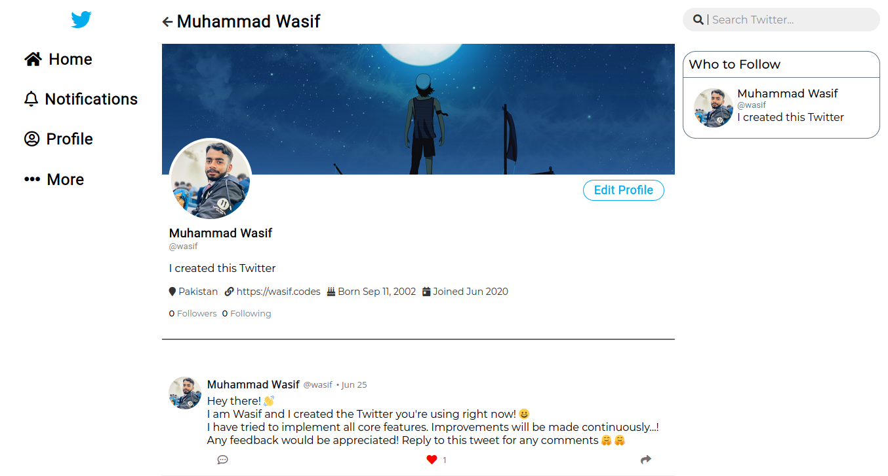

<h1>Twitter Clone</h1>



This is the front end only! open [muhammadwasif/twitter-clone-api](https://github.com/muhammadwasif/twitter-clone-api) to see backend

## 🧑‍💻 Tech Stack

- ReactJS
- SCSS
- other React and JavaScript libraries

## 📦 Setup

To run this app locally,

```bash
$ git clone https://github.com/MuhammadWasif/twitter-clone-client.git
$ cd twitter-clone-client
$ npm install
$ npm start
```

> Server must be started before

Change server variable in `src/helpers/utils.js` to the url of server (only if you're running server locally.) If you want to run front end only skip this step

The app wil start on http://localhost:3000

_Happy Coding!_
